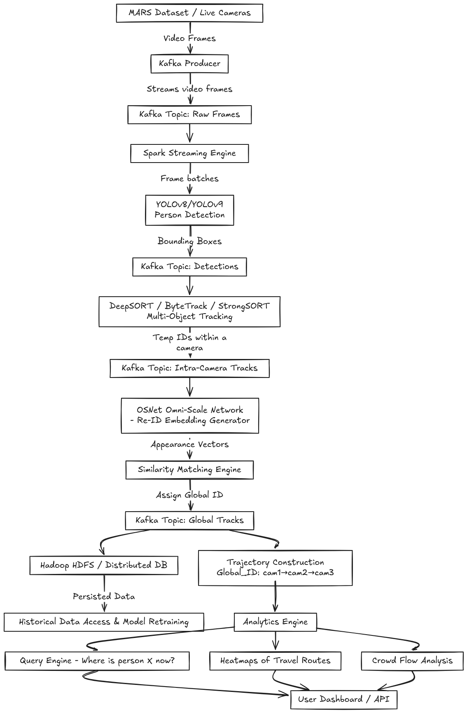

# Distributed Real-Time Video Analytics

### About project

The rapid expansion of urban surveillance networks has led to an enormous volume of video data being generated across multiple camera feeds. Traditional human monitoring is neither scalable nor reliable, making **automated video analytics** essential for ensuring safety, operational efficiency, and intelligent monitoring. One of the most critical challenges in this domain is **multi-camera person re-identification (Re-ID)**—the task of detecting, tracking, and consistently identifying individuals across non-overlapping camera views.

This project aims to design and implement a **real-time, distributed multi-camera person tracking and re-identification system** that can:

1. **Ingest video feeds** from multiple cameras or datasets (e.g., the MARS dataset) in a scalable manner.
2. **Detect individuals** within each camera stream using state-of-the-art object detection models such as **YOLOv8/YOLOv9** for accurate and efficient person detection.
3. **Track individuals within a single camera** using multi-object tracking algorithms such as **DeepSORT, ByteTrack, or StrongSORT**, which assign unique temporary IDs to each person in that camera.
4. **Re-identify individuals across multiple cameras** using deep appearance-based models such as **OSNet (Omni-Scale Network)**, trained or fine-tuned on large-scale person Re-ID datasets like **MARS** or **DukeMTMC**. By extracting discriminative embedding vectors for each person and comparing similarity scores, the system ensures consistent **global IDs** across different camera streams.
5. **Construct global trajectories** by merging intra-camera tracks with inter-camera re-identifications. This enables building a **graph-based representation of movement patterns** across the camera network, e.g., `{Global_ID: [cam1 → cam3 → cam5]}`.
6. **Provide analytics and query functionalities**, such as:
   - Locating a given individual across all cameras when provided with a reference face or frame.
   - Generating **real-time heatmaps** of frequently traveled routes.
   - Performing **crowd flow and congestion analysis** for decision support in smart cities, transport hubs, and security applications.

To support real-time scalability, the system leverages a **distributed big data architecture**:

- **Apache Kafka** is used as the backbone for **streaming video feeds**, enabling fault-tolerant, high-throughput ingestion of data from multiple cameras. In this project, Kafka producers will also be used to simulate streaming from offline datasets such as **MARS**.
- **Apache Spark (with Scala)** is employed for **distributed processing** of detection, tracking, and embedding generation, ensuring high-performance analytics over large-scale, continuous data streams.
- **Hadoop HDFS** or a distributed storage layer is integrated for **long-term storage and retrieval**, making historical data available for further analysis and model retraining.
- The final results (detections, embeddings, global IDs, trajectories) are published back into Kafka topics for downstream applications such as **dashboards, visualization, or automated alert systems**.

By combining **streaming architectures (Kafka + Spark)** with **computer vision models (YOLO, DeepSORT, OSNet)**, the project provides a comprehensive pipeline for **real-time person detection, tracking, and re-identification across multiple cameras**. The use of benchmark datasets such as **MARS** allows the system to be evaluated against standard protocols, ensuring robust performance before deployment on live video streams.

This system can serve as a foundation for **smart surveillance applications**, **crowd management**, **transportation monitoring**, and **public safety**, bridging the gap between research and deployable real-world solutions.

## 1. **Data Ingestion**

- **Dataset**: We use the **MARS dataset**, a large-scale video dataset for person re-identification.
  - Contains >1.1M frames from 6 cameras, with bounding-box tracklets of over 1,200 identities.
  - Suited for training and evaluating both **tracking** and **cross-camera re-identification**.
- **Streaming Setup**:
  - Instead of live CCTV, we simulate streaming using **Kafka producers**.
  - Each tracklet (video clip of a person) is published to a **Kafka topic** (e.g., `cam1-feed`, `cam2-feed`).
  - Metadata like `camera_id` and `timestamp` are embedded with the video frames.
- **Why**:
  - Kafka ensures **scalability and modularity**, letting us extend from offline dataset → real-time camera feeds without changing the downstream pipeline.

---

## 2. **Person Detection**

- **Algorithm**: **YOLOv8/YOLOv9**
  - Input: Frames streamed via Kafka.
  - Output: Bounding boxes + confidence scores for detected persons.
- **Why**: YOLO is fast, accurate, and suitable for real-time streaming environments.
- **Best Practices**:
  - Export YOLO to **ONNX** for efficient inference.
  - Apply **confidence threshold** (≥0.5) to filter false positives.
  - Use **non-max suppression (NMS)** to handle overlapping detections.

---

## 3. **Tracking (Within One Camera)**

- **Algorithm**: **DeepSORT / ByteTrack / StrongSORT**
  - DeepSORT: Uses motion + appearance features.
  - ByteTrack: Robust baseline for MOT.
  - StrongSORT: Adds stronger embeddings.
- **Workflow**:
  - YOLO detections are passed to the tracker.
  - The tracker maintains **local IDs** within each camera.
- **Why**: Prevents ID switches in the same camera feed.
- **Best Practices**:
  - Use motion + appearance jointly for stable tracking.
  - Keep track of lost persons for a few frames to handle occlusion.

---

## 4. **Re-Identification (Across Cameras)**

- **Algorithm**: **OSNet (Omni-Scale Network)**
  - Pretrained/fine-tuned on **MARS / DukeMTMC-reID**.
  - Outputs embedding vectors (e.g., 512-D) for each detected person.
- **Workflow**:
  - For each person tracklet → compute embedding.
  - Store embeddings in a **global embedding database**.
  - Compare embeddings using **cosine similarity**.
  - If similarity > threshold → assign same **global ID** across cameras.
- **Why**: Ensures that the **same person across different cameras** is consistently labeled.
- **Best Practices**:
  - Normalize embeddings (L2 normalization).
  - Use **re-ranking algorithms** (k-reciprocal re-ranking).
  - Add **spatio-temporal priors** (e.g., expected transition time between cameras).

---

## 5. **Trajectory Construction**

- **Workflow**:
  - Merge intra-camera tracklets (from DeepSORT/ByteTrack) with inter-camera matches (from OSNet).
  - Store trajectories as graph-like structures:
    ```
    {
      "global_id": "P123",
      "trajectory": [
        {"camera": "cam1", "frames": [...], "timestamps": [...]},
        {"camera": "cam3", "frames": [...], "timestamps": [...]}
      ]
    }
    ```
- **Why**: Allows reconstructing the **movement path of each person** across the camera network.
- **Best Practices**:
  - Store data in a **graph database (Neo4j)** for efficient path queries.
  - Maintain **confidence scores** for cross-camera ID assignments.

---

## 6. **Analytics Layer**

- **Functionalities**:
  - **Person Search**: Query “Where is person X now?” → find camera & timestamp.
  - **Face Search**: Input face image → extract embedding (ArcFace/InsightFace) → search embedding DB.
  - **Heatmaps**: Aggregate trajectories to highlight **crowded areas**.
  - **Crowd Flow Analysis**: Show directional flow of people between cameras.
- **Why**: Converts technical tracking into **practical insights**.
- **Best Practices**:
  - Use **FAISS / Elasticsearch** for fast embedding search.
  - Cache “active persons” for low-latency queries.
  - Consider **privacy-preserving measures** (face blurring / anonymization if needed).

---

## 7. **System Integration (Big Data Layer)**

- **Pipeline**:
  - **Kafka** → Ingest streams (from MARS producers).
  - **Spark Structured Streaming (Scala)** → Process streams (YOLO + tracker + ReID).
  - **HDFS (Hadoop)** → Store historical trajectories + embeddings.
  - **Kafka (results topics)** → Publish processed detections (JSON events).
  - **Dashboard (Flask/React)** → Visualize live feeds, IDs, and analytics.
- **Why**: Provides a **scalable, fault-tolerant, and distributed** system for real-time video analytics.
- **Best Practices**:
  - Tune Spark micro-batches (avoid tiny batches → overhead).
  - Offload heavy inference (YOLO, OSNet) to **GPU inference servers** (e.g., NVIDIA Triton).
  - Use **schema-based Kafka topics** (Avro/Protobuf) for structured event publishing.

---

# Final Workflow (Step-by-Step Summary)

1. **MARS dataset tracklets → Kafka producers** simulate live camera feeds.
2. **Kafka topics** stream frames with metadata (`camera_id`, `timestamp`).
3. **Spark Structured Streaming** consumes frames → YOLO detector → bounding boxes.
4. **DeepSORT/ByteTrack** assigns **local IDs** per camera.
5. **OSNet embeddings** extracted → stored in DB → matched across cameras.
6. Assign **global IDs** for same person across different cameras.
7. Build **trajectories** (graph structure) for each person.
8. Store events in **HDFS** and publish results back to Kafka.
9. **Dashboard** consumes results → shows live detections, trajectories, analytics (search, heatmaps, flow).


